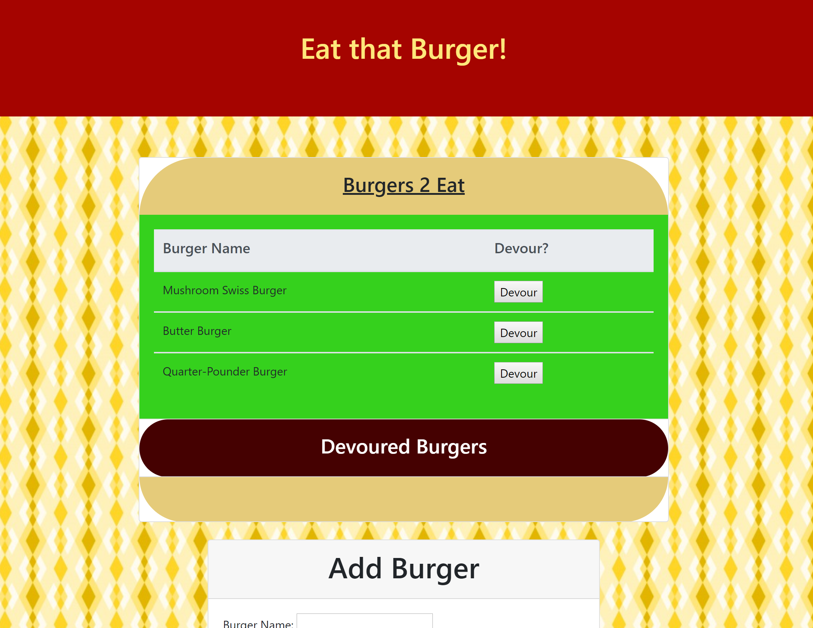

# Eat that Burger!

# Use the App
[Click here to go to the Live Site](https://vast-sands-19635.herokuapp.com/)

# Basic Instructions

 - The burger menu is an accordion: click on the text on the different parts of the burger to open that portion or toggle it closed. 
 - To add a new burger, use the "Add Burger" menu below the main interface.

# Developer Notes
- The platform is hosted on Heroku and uses JAWSDB to manage the MySQL table.
- Front End is composed of Bootstrap
- Node.js was used on the server side utilizing the following packages:
  - Express
  - Express-Handlebars
  - MySQL